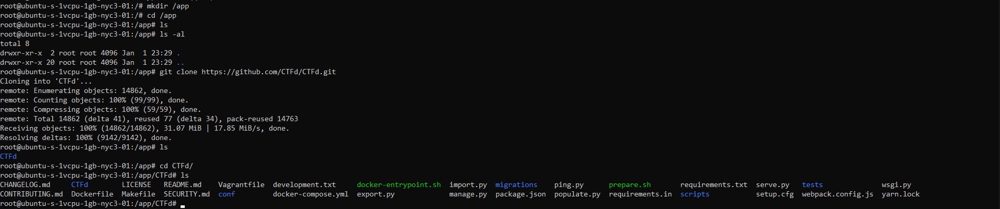

# Setting up a CTFd instance
This guide will teach you how to set up a CTFd instance using Docker and Docker Compose.

## Pre-requisites
- Basic knowledge of Docker and Docker Compose
- A cloud platform that supports Docker and Docker Compose (e.g. DigitalOcean, AWS, GCP, etc.)
- Knowledge of how to use a command line interface (CLI)
- Ability to use `ssh` and `scp` 
- Money (or cloud platform credits)

### **<span style="color:#ff5000"> Note: This guide does not cover how to set up individual challenges. It only covers how to set up the overall CTFd website.</span>**
If you want to know how to set up individual challenges, refer to [this guide](DEPLOY.md).

---

# Step 1: Set up a server
The first step is to set up a server to host the actual CTFd instance. This can be done on any cloud platform that supports Docker and Docker Compose. For this guide, I will be using DigitalOcean. 

If you are using a different cloud platform, the exact steps to set up a server will not be covered. However, after accessing the server through `ssh`, you can continue with the rest of the guide from [here](#step-2-clone-the-ctfd-repository).

## DigitalOcean Setup
If you do not already have an account with DigitalOcean, try to find a promotional registration link to get free credits. This guide does not offer any referral links, so you will have to find one on your own. GitHub Student Developer Pack members can also get $200 in credits for one year.

After you are logged in, you should be greeted with a screen that looks like this:


Navigate to the Droplet tab on the left sidebar and click on the Create button.


You should see the Droplet creation page.


### Droplet Settings
For this guide, we will be using the following settings:

**<span style="color:#ff5000"> Note: These settings may have changed by the time you read this guide, try to follow along as best as possible</span>**
- Ubuntu 22.10 x64
- Basic Plan
- Regular CPU / SSD
  - $6/mo (You can use a smaller plan if you want to save money)
  - 1 GB / 1 CPU
  - 25 GB SSD
  - 1000 GB Transfer
  
Choose a datacenter region that is closest to you. This will reduce latency and improve performance. You can test latency using [this website](https://cloudpingtest.com/digital_ocean).

### SSH Keys
If you do not already have a keypair, create a new SSH key. Follow the instructions on the page, and **make sure to save the private key**. You will need it later.


You can enable monitoring, IPv6, and User data if you want, they are not required for this guide.

After selecting these settings, click on the Create Droplet button. You should be redirected back to your project dashboard. Click on the Droplet you just created after it is done loading.


# Step 2: Clone the CTFd repository
At this point, you should have a cloud server that you can access. `ssh` into the server **as root** using the private key you saved earlier.

```bash
ssh -i /path/to/private/key root@<server_ip>
```

You should now be in the server. Install Docker and Docker Compose using the following commands: (From the [official Docker documentation](https://docs.docker.com/engine/install/ubuntu/#set-up-the-repository))

```bash
sudo apt-get update
sudo apt-get install \
    ca-certificates \
    curl \
    gnupg \
    lsb-release
sudo mkdir -p /etc/apt/keyrings
curl -fsSL https://download.docker.com/linux/ubuntu/gpg | sudo gpg --dearmor -o /etc/apt/keyrings/docker.gpg
echo \
  "deb [arch=$(dpkg --print-architecture) signed-by=/etc/apt/keyrings/docker.gpg] https://download.docker.com/linux/ubuntu \
  $(lsb_release -cs) stable" | sudo tee /etc/apt/sources.list.d/docker.list > /dev/null
sudo apt-get update
sudo apt-get install docker-ce docker-ce-cli containerd.io docker-compose-plugin
```

We will be working in `/app` for this guide. Create the directory and change into it.

```bash
mkdir /app
cd /app
```

After Docker and Docker Compose are installed, clone the CTFd repository using the following command:

```bash
git clone https://github.com/CTFd/CTFd.git
cd CTFd
```



# Step 3: Configure the CTFd instance
Now that we have the CTFd repository cloned, we need to configure the CTFd instance. This can be done by editing the `docker-compose.yml` file. Open the file using your favorite text editor.

```bash
nano docker-compose.yml
```

Modify the `SECRET_KEY` to a random, secret string.


Now build the images and run the containers. This might take a while.

```bash
docker compose up -d --build
```


When all is said and done, you should be able to access the CTFd instance at `http://<server_ip>:80`. You can also access the admin panel at `http://<server_ip>:80/admin`.

To check that your CTFd instance is running, run the following command, and you should see all 4 containers running.

```bash
docker ps
```


Access your CTFd instance at `http://<server_ip>:80`. You should see a setup page. Fill out the form (everything can be edited later).

# Step 4: Done!
Now that you have a CTFd instance running, there a few things to do before fully launching the CTF.
- Set up SSL/TLS (Requires a domain name)
  - https://dev.to/roeeyn/how-to-setup-your-ctfd-platform-with-https-and-ssl-3fda
- Configure email 
- Set up challenges

But for now, you have a working CTFd instance. Congratulations! 

Thank you for reading to the end of this guide. If you have any questions or comments, feel free to email me at [flocto@duck.com](mailto:flocto@duck.com)

